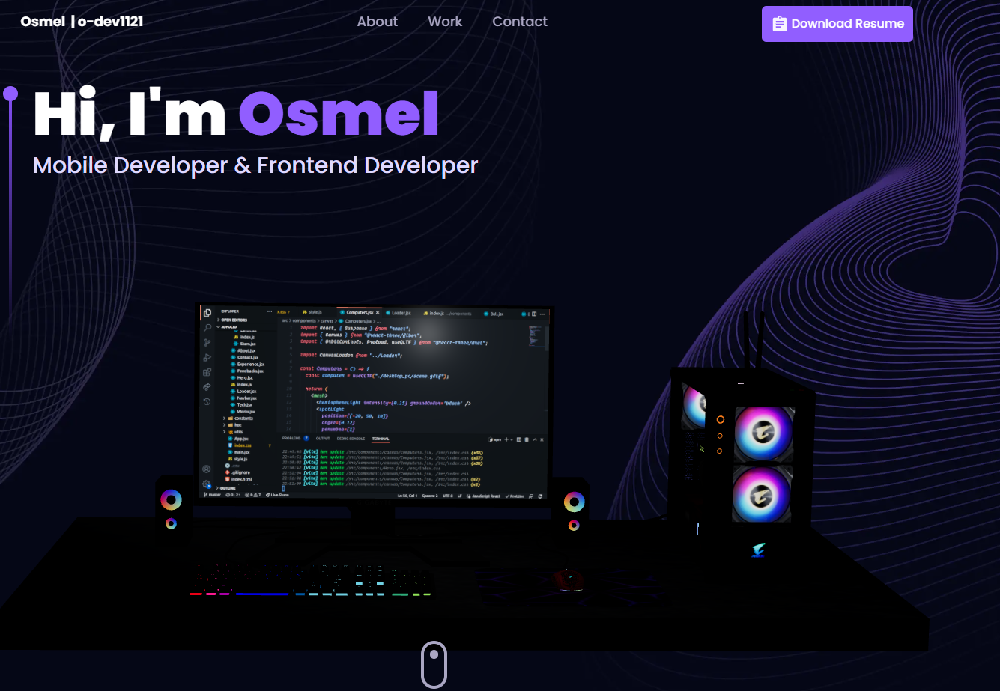

# Project 3D - Portfolio

<p align="center">
  
</p>

This was my project using Vite. Initially made using tutorial of JavaScipt Mastery.

Work done on it other than the tutorial:-
- Removed unused CSS.
- Removed Extra Animations.
- Made UI Faster.
- Added a Resume Button (Where you can put a link to your resume).
- Enhanced Visibility and solved Responsive UI Problems.

This Project is hosted in Netlify : [3D Portfolio](https://osmel-trillo.netlify.app/)

## :star: Give A Star

You can also give this repository a star to show more people and they can use this repository.

# Getting Started

These instructions will get you a copy of the project up and running on your local machine for development and testing purposes.

Prerequisites
Before you start, make sure you have the following software installed on your computer:

[](https://skillicons.dev)


## ℹ️ How to use this Repository?

1. Clone the repository to your local machine

```bash
  git clone https://github.com/your-github-username/Portfolio-nextjs-threejs.git

```
2. Navigate to the project directory

```bash
  cd Portfolio-nextjs-threejs
```
3. Install the necessary dependencies
```bash
  npm install
```

4. Start the development server
```bash
  npm run dev
```

The website should now be up and running on http://localhost:3000.

## 🏠 Built With:

[](https://skillicons.dev)

## 🛠 Skills

[](https://skillicons.dev)

## 🚀 About Me
Specializations:
- Mobile Application Development.
- Web Development.
- Complex visualization development.
- 3D animations and configurators building.
- GIS features development.

## 🙋‍♂️ Connect With Me

[](https://github.com/o-dev1121)&nbsp;
[](https://www.linkedin.com/in/osmel-trillo/)&nbsp;

## 🗒️ Authors
- Osmel Trillo

<p align="left">
  <a href="https://skillicons.dev">
    <a href="https://github.com/o-dev1121">
      
    </a>
  </a>
</p>